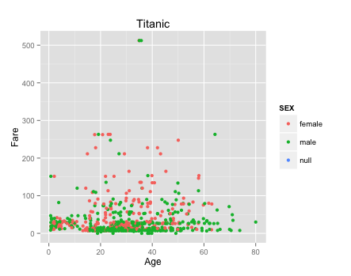
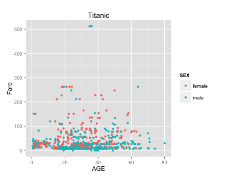
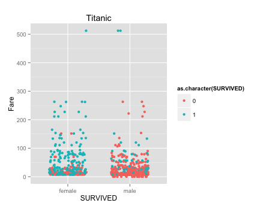
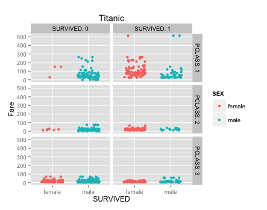
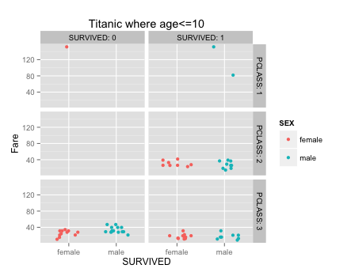
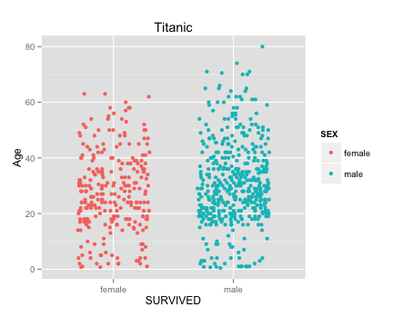

---
output:
  html_document:
    pandoc_args: [
      "+RTS", "-K64m",
      "-RTS"
    ]
---
## Age vs Fare (with null) 

 

## Age vs Fare (without null) 

 

## Survived vs Fare  

 

## Survived vs Fare by class 

 

## Survived vs Fare for children under 10 years of age 

 

## Survived vs Age 

 

## Head and summary of data 

```{r}
require("jsonlite")
require("RCurl")
df <- data.frame(fromJSON(getURL(URLencode('129.152.144.84:5001/rest/native/?query="select * from titanic"'),httpheader=c(DB='jdbc:oracle:thin:@129.152.144.84:1521/PDBF15DV.usuniversi01134.oraclecloud.internal', USER='cs329e_shs855', PASS='orcl_shs855', MODE='native_mode', MODEL='model', returnDimensions = 'False', returnFor = 'JSON'), verbose = TRUE), ))

summary(df)
head(df)
```

